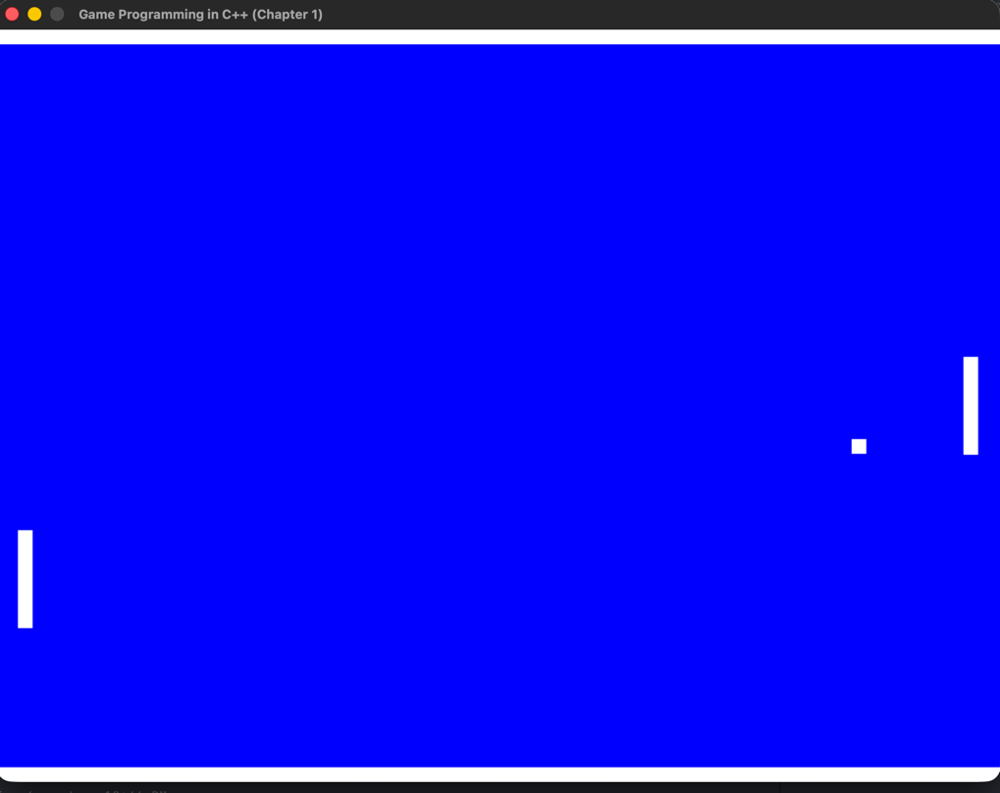

# Pong Game

Following the book Game Programming in C++, this project implements the classic Pong game.

Currently, it supports two players.

Requires SDL2 (`brew install sdl2`).

## Controls

| Action | Left paddle | Right paddle |
|--------|-------------|--------------|
| Up     | W           | I            |
| Down   | S           | K            |
| Quit   | Esc         | Esc          |

